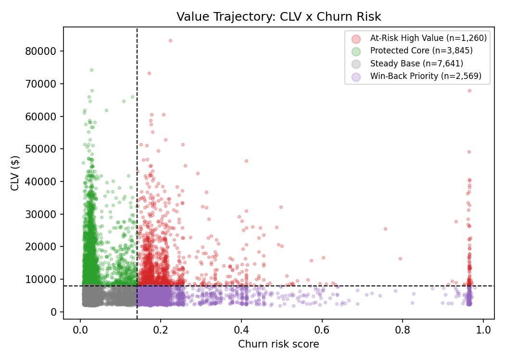

# Value Trajectory: Is CLV Telling the Full Story?

## Revision note
An earlier version of this analysis paired CLV with `momentum` (H2-H1 2017
flight trend), claiming a "decelerating high-value" group churned at ~2x the
rate of an "accelerating high-value" group. That finding was an artifact of
including 1,422 members already cancelled on/before 2017 (guaranteed
`blended_churn == 1` by construction) in the analysis population -- it does
not survive correcting the population to the 15,315-member "at risk entering
2018" cohort (see `segmentation_summary.md`). On the corrected population:

| Check | Correlation with `blended_churn` |
|---|---|
| `momentum` (H2-H1 2017 flights) | **-0.013** (no relationship) |
| `recency_months` | 0.302 |
| `CLV` | 0.001 |
| `CLV` vs. `churn_risk_score` | 0.013 |

**Momentum does not predict next-year churn.** This is reported here rather
than dropped quietly -- it is itself a useful finding (see
`segmentation_summary.md` §3, Cooling Loyalists).

## The real answer: No -- CLV tells you nothing about risk, and the model does

CLV is essentially **independent of the churn-risk score** (r = 0.013) and of
actual churn (r = 0.001). The churn-risk score, meanwhile, **is** reasonably
calibrated for the engaged population (AUC 0.65, see
`churn_model_summary.md`). So the framework that actually holds up pairs CLV (value) with
**`churn_risk_score`** (the model's actual forward-looking signal) -- not
with a trend metric that turns out to carry no signal.

**Quadrants** (CLV >= top tercile = "High CLV" >= $7,997; `churn_risk_score`
>= top quartile = "Elevated Risk" >= 0.141):

| Quadrant | n | Avg CLV | Total CLV | Avg churn risk | Actual churn rate |
|---|---|---|---|---|---|
| **At-Risk High Value** (High CLV, Elevated Risk) | 1,260 | $14,948 | **$18.8M** | 0.262 | 0.270 |
| Protected Core (High CLV, Lower Risk) | 3,845 | $14,421 | $55.4M | 0.034 | 0.024 |
| Win-Back Priority (Low/Mid CLV, Elevated Risk) | 2,569 | $4,704 | $12.1M | 0.261 | 0.255 |
| Steady Base (Low/Mid CLV, Lower Risk) | 7,641 | $4,659 | $35.6M | 0.034 | 0.029 |

## The headline finding

**$18.8M of CLV (1,260 members) sits in members the model flags as
elevated-risk** (avg score 0.262, well-calibrated against the actual 0.270
churn rate for this group). A CLV-only report would never surface this group
-- their CLV ($14,948 avg) is statistically indistinguishable from the
"Protected Core" ($14,421 avg, only 0.024 actual churn). **CLV and risk are
two independent axes; reporting CLV alone hides exactly half of the picture.**

The risk score itself is dominated by `recency_months` and `tenure_years`
(see `churn_model_summary.md`) -- in practice, "At-Risk High Value" is
populated heavily by members in the **Dormant/Lapsed** segment who happen to
have above-median CLV, plus a smaller number of VIP/New-segment members with
elevated recency. See the segment x quadrant crosstab in
`retention_playbook.md`.

## Implication
- **$18.8M of CLV requires a different motion than the "Protected Core"
  ($55.4M, low risk)** -- this is the highest-priority save target by CLV
  density.
- **A second, larger pool ($12.1M across 2,569 members) sits in lower-CLV,
  elevated-risk members** -- a cost-effective win-back target by volume.
- Together, this directly feeds the retention playbook
  (`retention_playbook.md`): both elevated-risk quadrants get a save/win-back
  treatment, distinguished from the "Protected Core" / "Steady Base" members
  who get nurture/recognition instead.
