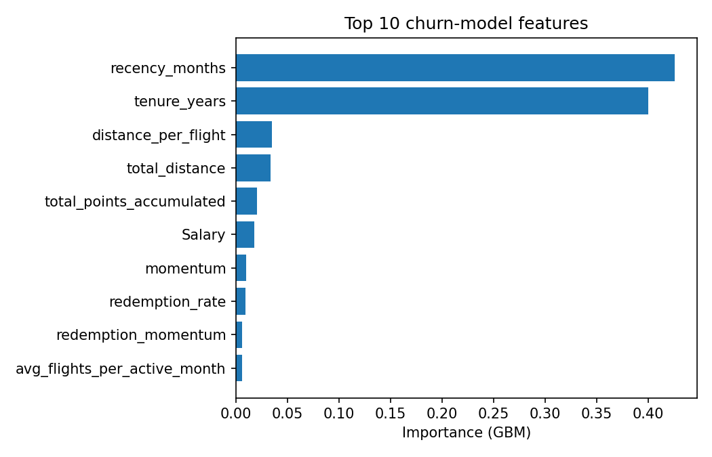
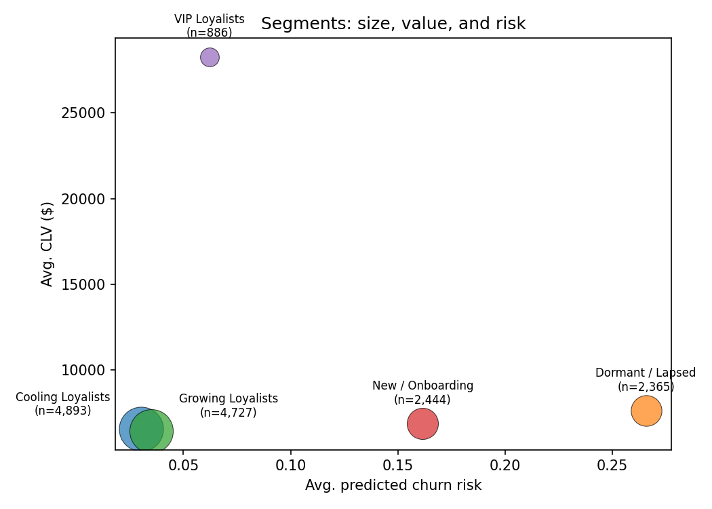

# Unlocking Behavioral Intelligence in Airline Loyalty Programs
### Technical Report — Churn, Segmentation, and Retention Strategy

---

## Executive Summary

The loyalty program has **16,737 enrolled members**. Of the 15,315 members
still enrolled at the start of 2018, **8.5% will churn during 2018** under a
definition that combines formal cancellations with sustained behavioral
inactivity. A gradient-boosted model trained on 2017 behavior alone (no
look-ahead) separates churners from non-churners with an AUC of **0.78
overall** (0.65 restricted to members who were actually flying in 2017 — the
realistic retention-targetable population).

Three findings should change how the marketing team prioritizes:

1. **CLV tells you nothing about who is at risk — and that's the
   discovery, not a flaw.** Across the 15,315-member cohort, CLV is
   essentially uncorrelated with the churn-risk score (r ≈ 0.01) and with
   actual 2018 churn (r ≈ 0.001). $18.8M of CLV sits in 1,260 members the
   model flags as elevated-risk (avg score 0.262, matching their actual
   27.0% churn rate) — and their average CLV ($14,948) is statistically
   indistinguishable from a $55.4M pool of equally high-CLV members the
   model scores as low-risk (avg score 0.034, actual churn 2.4%). A
   CLV-only report literally cannot separate these two groups; pairing CLV
   with the model's risk score is what makes the difference visible.
2. **We tested whether "decelerating but still active" predicts churn — it
   doesn't.** An earlier hypothesis (and an earlier draft of this analysis)
   was that members whose H2-2017 flight activity dropped versus H1 ("cooling")
   would churn at a higher rate than members trending up, even at the same
   absolute activity level. On the corrected cohort, the correlation between
   this within-year trend and 2018 churn is **-0.013** — essentially zero.
   What *does* predict churn is **absolute recency** (`recency_months`,
   r = 0.30): how long it's been since a member's last flight, not which
   direction their activity is moving. We report the null result because it
   changes how the 4,893-member "Cooling Loyalists" segment should be
   treated — as a healthy segment (2.6% actual churn, the lowest of all
   five), not a risk segment.
3. **15.4% of the membership base (2,365 members) is already dormant**
   (zero flights in 2017, recency 12 months) and accounts for 28.4% blended
   churn — by far the highest of any segment. They should be removed from
   "churn prevention" spend entirely — they need **reactivation**, a
   fundamentally different (and cheaper) motion than retention.

**Three recommendations** (detailed in §6):
1. **Stand up a CLV x churn-risk save campaign** — the single highest-CLV
   risk pocket the business can act on today: 300 members (33 VIP "win-back
   urgent" + 267 "high-value win-back"), $4.6M combined CLV, churning at
   49-55% vs. 2-3% for their CLV-equivalent "Protected Core" peers.
2. **Separate reactivation budget from retention budget.** The 627-member
   "Standard reactivation" group plus the Dormant/Lapsed-heavy population
   behind it (avg 48-55% blended churn) need a low-cost automated win-back
   sequence — a different (and cheaper) motion than the save campaigns in
   recommendation 1.
3. **Build a structured first-90-days onboarding journey** for the 3,010
   members enrolled in 2018 (18.1% churn rate, ~2-3x the 2.3-2.8% rate of
   comparable low-risk established-member groups), whose model scores are
   extrapolations and whose churn drivers differ in kind from established
   members.

---

## 1. Problem Framing

The brief asks three questions: (1) who is going to leave and why, (2) who is
actually valuable — beyond the CLV number already on file, and (3) what
should the business *do* about it, specifically enough that a marketing
manager can act without translation.

We treat this as a **2017 -> 2018 prediction problem**: every feature used to
predict or segment is computed from 2017 data only; 2018 data is used
exclusively to define and evaluate the churn outcome. This "observation
window / outcome window" split is the backbone of every leakage check in this
project.

---

## 2. Data & Cleaning Decisions

Two source tables: **Customer Loyalty History** (16,737 members; demographics,
loyalty card tier, CLV, enrollment/cancellation dates) and **Customer Flight
Activity** (389,089 rows after cleaning; monthly flights, distance, points
accumulated/redeemed, Jan 2017 - Dec 2018).

Key decisions (full detail in `reports/supporting_analysis/data_quality_notes.md`):

- **Duplicate flight rows** (3,847 of ~16,700 customer-months had >1 row):
  exact duplicates dropped; remaining same-customer-month rows with differing
  values were **summed** (interpreted as multiple bookings within a month).
- **Negative salaries** (20 records, all Bachelor's-degree, magnitudes
  consistent with normal range): treated as a sign-entry error -> `abs()`.
- **Missing salary (25.3% of members)** is **not random** — it is 100%
  concentrated in members with `Education == "College"`. We did **not**
  impute a population value (which would fabricate income signal for a
  quarter of the base). Instead we kept a `salary_missing` flag and let the
  model use `Education` as the real income proxy for this group.
- **The cancellation flag is an unreliable, lagging churn signal**: 29% of
  formally "cancelled" members still flew in 2018, while many members who
  cancel show zero activity for months/years *before* the cancellation date.
  This single finding is what motivates the blended churn definition in §3.
- **CLV is essentially independent of every other field** (|r| < 0.04 with
  flight activity, tenure, salary, even cancellation year). We treat it as
  given/exogenous: useful for *value* analysis, but excluded from the *churn
  model* (see §4) because it adds no signal and isn't a clean
  observation-window feature.

---

## 3. Defining Churn (No Label Existed)

We tested two definitions against the 15,315-member cohort that was still
enrolled entering 2018:

| Definition | Rate | Issue |
|---|---|---|
| **Hard churn** (`Cancellation Year == 2018`) | 4.2% | Correlation with 2017 engagement ≈ 0. Many cancellers were flying normally — cancellation looks driven by factors *outside* this dataset. |
| **Behavioral churn** (zero flights in 2018) | 4.6% | 89% of these members (624 of 701) were *already* fully inactive in 2017 too — for them, "churning in 2018" is the continuation of a pre-existing dormant state, not a new event. |

Only **40 members** satisfy both definitions — they are largely different
populations. Decomposing the cohort into three groups makes the picture
clear:

| Group | Size | Interpretation |
|---|---|---|
| **Newly dark** (active 2017, silent 2018) | 77 | The genuine "we're losing an engaged customer" group — but **uncorrelated with any 2017 engagement feature**. |
| **Already dark** (silent in both years, never cancelled) | 624 | Structurally dormant from day one. A reactivation problem, not a churn problem. |
| **Hard-churn-only** (cancelled but kept flying through 2018) | 605 | The cancellation event itself, not engagement, carries the signal. |

**Decision**: the primary label is **`blended_churn = hard_churn OR
behavioral_churn`** (8.5% of the cohort). It captures both failure modes the
business cares about ("stop flying" and "formally leave") and correlates far
more strongly with 2017 engagement (`recency_months` r = 0.30,
`pct_months_active` r = -0.30) than hard churn alone — i.e., it is the more
*learnable* definition. The `was_active_2017` flag is carried forward so the
"already dark" members are routed to reactivation rather than retention in
the playbook (§6).

**A real gap, not a fix**: the "newly dark" group — arguably the highest-value
churn-prevention target — is too small (77 members) and too uncorrelated with
engagement data to be modeled directly. We do not pretend the model or the
playbook solves this: it is reported here as a structural gap that would
need a different data source (service contacts, competitor activity) to
close, not a model tuning problem (§7).

---

## 4. Churn Prediction Model

**Setup**: GradientBoostingClassifier (benchmarked against class-weighted
Logistic Regression), predicting `blended_churn` from 2017-only features:
flight volume, recency, momentum (H2 vs H1 trend), redemption behavior,
distance/flight, plus demographics (Salary, Education, Marital Status,
Loyalty Card, Province, Enrollment Type) and tenure.

**Two refinements made during review** (full detail in
`reports/supporting_analysis/churn_model_summary.md`):

1. **CLV excluded** — independent of all other fields (§2), adds ~2%
   importance, and is not a clean observation-window feature.
2. **Training restricted to 12,305 members enrolled on/before 2017.** The
   3,010 members enrolled *during* 2018 have zero 2017 history by
   construction (identical feature vectors regardless of who they are) and a
   3x higher churn rate (18.1% vs. 6.2%) — including them would teach the
   model a trivial "no history -> high risk" rule rather than a behavioral
   pattern. They are still **scored** by the fitted model (flagged
   `in_training_cohort = 0`) and routed to a dedicated onboarding journey
   (§6, recommendation 3).

### Performance (held-out 25% test set, n=12,305 training cohort)

| Slice | n | Churn rate | AUC | PR-AUC |
|---|---|---|---|---|
| Overall | 3,077 | 6.2% | **0.775** | 0.473 |
| Was active in 2017 (the realistic retention population) | 2,938 | 4.0% | **0.654** | 0.109 |

**Top features**: `recency_months` (43%) and `tenure_years` (40%) account for
~83% of importance — i.e., "how long since they last flew" and "how
established the member is" are the two dominant signals, both intuitive and
both free of leakage. `distance_per_flight`, `total_distance`, `Salary`, and
`momentum` make up most of the remainder.

**Why 0.65 (not higher) is the right number, not a weak model**: a much
higher AUC for the engaged-member population would be a leakage red flag,
given the §3 finding that the highest-value churn group ("newly dark") is
uncorrelated with engagement features. A realistically-scoped 0.65, paired with
CLV to prioritize *which* flagged members matter most (§5), is more
defensible than an inflated number from a definition that quietly excludes
the hard cases.

---

## 5. Segmentation & Value: Beyond CLV

### 5.1 Why CLV alone is insufficient
CLV barely varies across 4 of the 5 behavioral segments (~$6,400-$7,600) and
is nearly independent of every behavioral signal (§2). **A CLV-only report
would treat most of the membership base as one homogeneous group.** We built
a 5-segment K-means clustering (silhouette ≈ 0.30) on CLV, total flights,
% months active, recency, redemption rate, tenure, and momentum, restricted
to the **15,315-member "at risk entering 2018" cohort** (`in_cohort == 1` —
see §5.3 for why this restriction matters):

| Segment | Size | % | Avg CLV | Engagement (2017) | Momentum (H2-H1) | Churn risk (model) | Actual churn rate |
|---|---|---|---|---|---|---|---|
| **VIP Loyalists** | 886 | 5.8% | $28,287 | 53% months active, recency 1.1 | +1.7 | 0.06 | **5.0%** |
| **Growing Loyalists** | 4,727 | 30.9% | $6,416 | 62% months active, recency 0.4 | **+6.2** | 0.04 | 3.2% |
| **Cooling Loyalists** | 4,893 | 31.9% | $6,524 | 59% months active, recency 0.9 | **-3.7** | 0.03 | **2.6%** |
| **New / Onboarding** | 2,444 | 16.0% | $6,835 | 14% months active, tenure **0.4 yrs** | +3.0 | 0.16 | 12.9% |
| **Dormant / Lapsed** | 2,365 | 15.4% | $7,588 | 0% months active, recency **12.0** | 0.0 | 0.27 | **28.4%** |

The standout finding: **Growing Loyalists and Cooling Loyalists have nearly
identical current engagement (62% vs. 59% months active) and CLV ($6,416 vs.
$6,524)** — a snapshot view would treat them as the same group, and they
differ sharply in *trajectory* (momentum +6.2 vs. -3.7). But **Cooling
Loyalists actually have the lowest actual churn rate of all five segments
(2.6%, vs. 3.2% for Growing Loyalists)** — the opposite of what a
"decelerating = at risk" intuition would predict. We tested this directly:
on this cohort, `corr(momentum, blended_churn) = -0.013` — within-year trend
carries essentially no signal once absolute engagement level is accounted
for. This is reported as a finding, not hidden — see §5.2.

A demographic check confirms the segmentation isn't a tiering artifact:
Loyalty Card tier (~45/34/20% Star/Nova/Aurora split) and Education
distributions are nearly identical across all 5 segments — **value and risk
are driven by behavior, not by which card a member holds.**

### 5.2 Value Trajectory: CLV x churn-risk, not CLV x momentum

Our first attempt at this analysis paired CLV with `momentum` (H2 vs. H1
2017 flight trend), on the hypothesis that "decelerating but still
high-value" members were an underpriced risk. As shown in §5.1, that
hypothesis does not survive: momentum is uncorrelated with 2018 churn
(r = -0.013) on the corrected 15,315-member cohort. We report this rather
than discard it, because the *negative* result changes how "Cooling
Loyalists" should be treated (a healthy segment, not a risk segment) — and
because chasing a phantom 2x-churn finding based on momentum would have sent
the marketing team's save budget at the wrong 1,512 members.

The framework that **does** hold up: CLV is essentially **independent of the
churn-risk score** (r = 0.013) and of actual churn (r = 0.001) — while the
churn-risk score itself **is** reasonably calibrated for established members
(§4). Pairing CLV (top-tercile = "High CLV", >= $7,997) with the churn-risk
score (top-quartile = "Elevated Risk", >= 0.141) produces four quadrants:

| Quadrant | n | Avg CLV | Total CLV | Avg churn risk | Actual churn rate |
|---|---|---|---|---|---|
| **At-Risk High Value** (High CLV, Elevated Risk) | 1,260 | $14,948 | **$18.8M** | 0.262 | **0.270** |
| Protected Core (High CLV, Lower Risk) | 3,845 | $14,421 | $55.4M | 0.034 | 0.024 |
| Win-Back Priority (Low/Mid CLV, Elevated Risk) | 2,569 | $4,704 | $12.1M | 0.261 | 0.255 |
| Steady Base (Low/Mid CLV, Lower Risk) | 7,641 | $4,659 | $35.6M | 0.034 | 0.029 |

**Headline finding**: "At-Risk High Value" and "Protected Core" hold **almost
identical average CLV** ($14,948 vs. $14,421) — but the model's risk score
correctly separates them (0.262 vs. 0.034 avg, closely matching their actual
churn rates of 27.0% vs. 2.4%). **A CLV-only report cannot distinguish these
two $14k-CLV groups; the risk score can.** $18.8M of CLV sits in the
elevated-risk group — the highest-priority save target by CLV density — and
a second $12.1M sits in the lower-CLV elevated-risk group, a
cost-effective win-back-by-volume target. Both feed directly into the
playbook's save/win-back groups (§6); the two low-risk quadrants ($55.4M
and $35.6M) get nurture/recognition treatment instead.

### 5.3 Why segmentation excludes members already cancelled before 2017

1,422 of the 16,737 enrolled members had **already cancelled on or before
2017** — by construction they are guaranteed `blended_churn == 1` (they were
gone before the 2018 outcome window even begins) and have no
`churn_risk_score` (they were never scored, since they have no 2017
features to score from). Including them in segmentation/value analysis would
inflate "actual churn rate" and "avg churn risk" for whichever segments they
happened to fall into — purely as an artifact of the population definition,
not a real behavioral signal. All segmentation, value-trajectory, and
playbook numbers in this report are computed on the
**15,315-member `in_cohort == 1` population** ("at risk entering 2018"),
matching the churn-model's scoring population.

---

## 6. Smart Retention Playbook & Recommendations

Every member is mapped to **one of 7 action groups**: tenure status (new
vs. established) first, then the CLV x churn-risk `value_quadrant`, with VIP
segment membership setting tone/channel (white-glove vs. automated). Full
triggers, channels, timing and success metrics for each group are in
`reports/supporting_analysis/retention_playbook.md`; the dashboard (`dashboard/app.py`) surfaces
this per-member for the marketing team. The three highest-impact groups:

### Recommendation 1: CLV x churn-risk save campaign
**Who**: "VIP win-back (urgent)" (33 members, $1.17M CLV, avg risk 0.473,
actual churn **54.5%**) + "High-value win-back" (267 members, $3.41M CLV,
avg risk 0.414, actual churn **49.1%**) = **300 members, ~$4.6M combined
CLV**. These are members in the top-tercile CLV bracket (avg ~$13-35k) whom
the model independently flags as top-quartile risk — their CLV is
indistinguishable from the $55.4M "Protected Core" pool (2.4% actual churn),
but their risk and outcomes are not.
**Trigger**: `value_quadrant == "At-Risk High Value"` (CLV >= $7,997 AND
churn-risk score >= 0.141), split by VIP segment membership for channel.
**Action**: VIP members (33) get a personal relationship-desk call with a
tier-hold guarantee and a bonus-mile offer, queued within 2 weeks; the
remaining 267 get a personalized win-back offer (bonus miles tied to
historical travel pattern) at the next quarterly refresh.
**Success metric**: reactivation rate within 60-90 days vs. a held-out
control group.

### Recommendation 2: Separate reactivation budget from retention budget
**Who**: "Standard reactivation" (627 members, $3.02M CLV, avg risk 0.412,
actual churn **48.8%**) — the lower-CLV counterpart to recommendation 1,
i.e. members in the elevated-risk quadrant ("Win-Back Priority") but below
the top-CLV tercile. This group is concentrated in the Dormant/Lapsed
segment (380 of 627), which independently has the highest segment-level
churn rate (28.4%, §5.1).
**Why it matters financially**: applying a *retention* offer (designed to
arrest a decline) to members already showing near-zero recent activity
(`recency_months` ≈ 7.6 avg) is the wrong tool and wastes spend that a
*reactivation* sequence (designed to restart from zero) uses more
efficiently.
**Action**: 3-email automated win-back sequence over 6 weeks ("we miss you"
-> "here's what's new" -> "limited-time bonus miles to fly again"), fully
automated given the lower per-member CLV ($4,815 avg) versus
recommendation 1.
**Success metric**: reactivation rate (any flight within 6 months) vs. a
no-contact control, tracked separately from recommendation 1 so
cost-per-reactivation can be compared against the higher-CLV save campaign.

### Recommendation 3: First-90-days onboarding journey
**Who**: "New / Onboarding journey" — 3,010 members enrolled during 2018
(`in_training_cohort == 0`), $24.1M total CLV. Actual churn rate **18.1%**
— roughly **6-9x** the 2.3-2.8% rate of the comparable low-risk
("Protected Core" / "Steady Base") established-member groups, and notably
higher than even this group's own model-predicted average (0.209).
**Why**: new members churn for different reasons (onboarding friction, unmet
first-impression expectations) than established members, and the model's
scores for this group are extrapolations (no 2017 history exists) — useful
for *relative* prioritization within the group, not as precise
probabilities. Within this group, 2,902 of 3,010 members already fall in an
elevated-risk quadrant (avg risk 0.21, churn 18-20%) vs. 108 in low-risk
quadrants (5.5-5.7% churn) — if onboarding capacity is constrained,
prioritize the former.
**Action**: welcome email with a first-flight bonus-points target, a 30-day
check-in if no activity, and a 90-day "redeem your first reward" prompt
(addresses the consistently low ~2% redemption rate seen even in healthy
segments).
**Success metric**: % of new members completing one flight + one redemption
within 6 months — a leading indicator that doesn't depend on the
extrapolated churn score.

---

## 7. Limitations & Open Questions

- **CLV's construction is unknown** (independent of all other fields,
  possibly assigned by a separate process). Recommendations involving CLV
  should be validated against the airline's actual CLV methodology before
  large budget commitments.
- **The "newly dark" group (77 members in the training cohort) cannot be
  predicted from flight-activity data alone**, and the playbook does not
  claim to solve this — it is a structural blind spot. Closing it would
  require a different data source (service contacts, NPS, competitor
  exposure), not further model tuning.
- **New-member (2018 enrollee) churn scores are extrapolations**, not
  validated predictions — this is why the "New / Onboarding journey" group
  (§6, recommendation 3) is defined by tenure status first, with the score
  used only for *relative* prioritization within that group.
- **Small-sample subgroups** (e.g., the 139 fully-dormant members in the
  training cohort, or the 33-member "VIP win-back (urgent)" group) produce
  high-variance metrics; directional, not point-estimate, interpretation is
  recommended for these.
